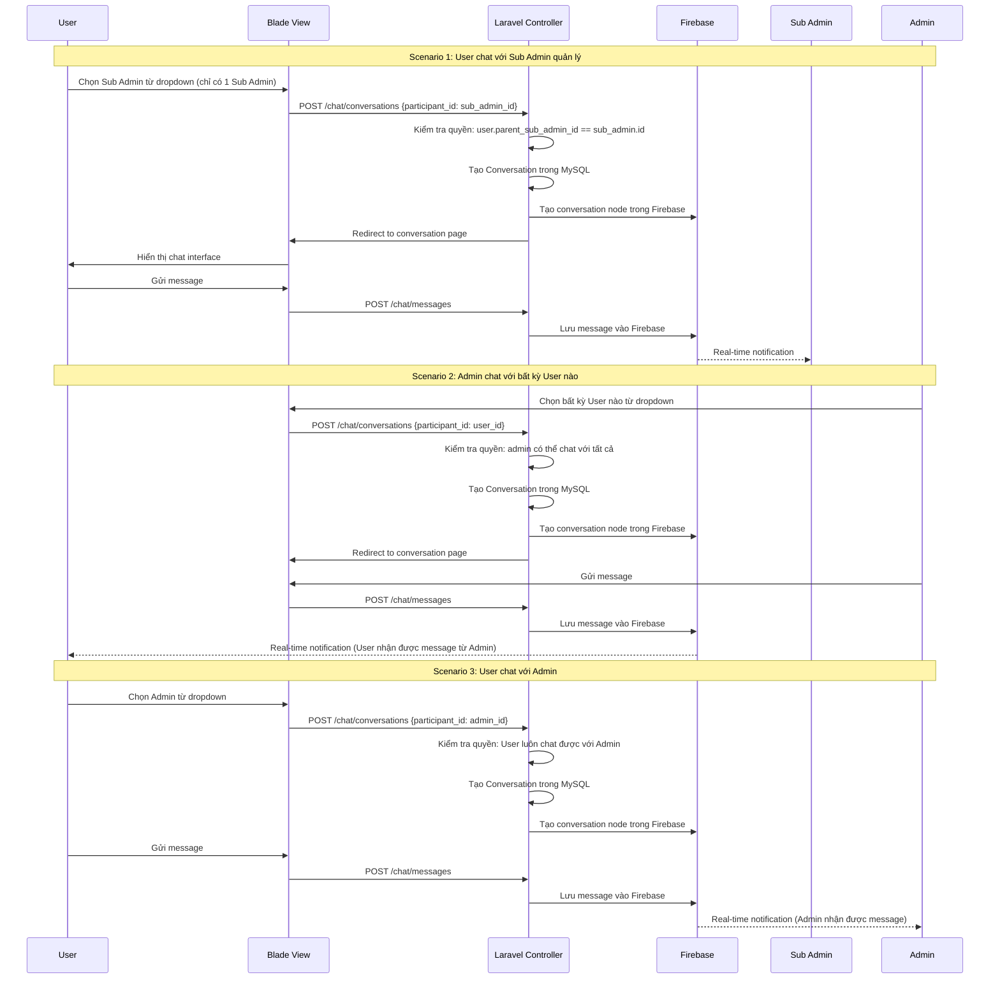

# Firebase Chat System - 1:1 Chat Documentation (Blade PHP)

## 1. TỔNG QUAN

### 1.1 Scope & Mục Tiêu
Xây dựng hệ thống chat 1:1 real-time giữa Admin, Sub Admin và User sử dụng Firebase Realtime Database, tích hợp với hệ thống Laravel hiện tại sử dụng Blade templates.

### 1.2 Yêu Cầu Chức Năng
- **Admin**: Chat 1:1 với tất cả User và Sub Admin
- **Sub Admin**: Chat 1:1 với User thuộc quyền quản lý và Admin
- **User**: Chat 1:1 với Admin và Sub Admin quản lý mình
- Gửi/nhận tin nhắn văn bản và hình ảnh
- Đánh dấu tin nhắn đã đọc (read receipt)
- Real-time messaging

### 1.3 Quyền Hạn Chat
```
ADMIN: Chat với tất cả Users và Sub Admins (không giới hạn)
SUB_ADMIN: Chat với Users thuộc quyền quản lý (parent_sub_admin_id = sub_admin.id) và Admin
USER: Chat với Sub Admin quản lý (parent_sub_admin_id) và Admin
```

### 1.4 Business Rules
- Mỗi User chỉ thuộc về 1 Sub Admin (parent_sub_admin_id)
- Admin có quyền chat với bất kỳ User nào, không phụ thuộc vào Sub Admin
- Sub Admin chỉ chat với Users thuộc quyền và Admin
- User chỉ chat với Sub Admin quản lý mình và Admin

## 2. DATA MODEL

### 2.1 Laravel Database Schema

#### Users Table (Existing)
```sql
users:
- id (Primary Key)
- name, email, password
- role (enum: 'admin', 'sub_admin', 'user')
- parent_sub_admin_id (Sub Admin quản lý User - chỉ có 1 Sub Admin cho mỗi User)
- status ('active', 'inactive')
- photo (avatar)

-- Business Logic:
-- Admin: parent_sub_admin_id = NULL
-- Sub Admin: parent_sub_admin_id = NULL  
-- User: parent_sub_admin_id = [sub_admin_id] (bắt buộc có 1 Sub Admin)
```

#### Conversations Table (Laravel)
```sql
CREATE TABLE conversations (
    id VARCHAR(50) PRIMARY KEY,
    type ENUM('direct') DEFAULT 'direct',
    created_by INT,
    created_at TIMESTAMP DEFAULT CURRENT_TIMESTAMP,
    updated_at TIMESTAMP DEFAULT CURRENT_TIMESTAMP ON UPDATE CURRENT_TIMESTAMP,
    FOREIGN KEY (created_by) REFERENCES users(id)
);
```

#### Conversation Participants Table (Laravel)
```sql
CREATE TABLE conversation_participants (
    id INT AUTO_INCREMENT PRIMARY KEY,
    conversation_id VARCHAR(50),
    user_id INT,
    joined_at TIMESTAMP DEFAULT CURRENT_TIMESTAMP,
    FOREIGN KEY (conversation_id) REFERENCES conversations(id) ON DELETE CASCADE,
    FOREIGN KEY (user_id) REFERENCES users(id) ON DELETE CASCADE,
    UNIQUE KEY unique_participant (conversation_id, user_id)
);
```

### 2.2 Firebase Realtime Database Structure

```json
{
  "conversations": {
    "{conversationId}": {
      "id": "conv_123456",
      "type": "direct",
      "participants": {
        "user_1": {
          "id": 1,
          "role": "admin",
          "name": "Admin Name",
          "avatar": "avatar_url"
        },
        "user_2": {
          "id": 5,
          "role": "user",
          "name": "User Name",
          "avatar": "avatar_url",
          "parentSubAdminId": 3
        }
      },
      "lastMessage": {
        "id": "msg_789",
        "senderId": 1,
        "content": "Hello!",
        "type": "text",
        "timestamp": "2024-01-01T12:00:00Z"
      },
      "unreadCount": {
        "user_1": 0,
        "user_2": 2
      },
      "createdAt": "2024-01-01T00:00:00Z",
      "updatedAt": "2024-01-01T12:00:00Z"
    }
  },
  
  "messages": {
    "{conversationId}": {
      "{messageId}": {
        "id": "msg_123456",
        "conversationId": "conv_123456",
        "senderId": 1,
        "senderName": "Admin Name",
        "senderRole": "admin",
        "content": "Hello, how can I help you?",
        "type": "text",
        "timestamp": "2024-01-01T12:00:00Z",
        "readBy": {
          "user_1": "2024-01-01T12:00:00Z",
          "user_2": null
        },
        "imageUrl": null,
        "imageName": null
      }
    }
  },
  
  "userPresence": {
    "{userId}": {
      "status": "online",
      "lastSeen": "2024-01-01T12:00:00Z"
    }
  }
}
```

## 3. SECURITY RULES

### 3.1 Firebase Security Rules

```javascript
{
  "rules": {
    "conversations": {
      "$conversationId": {
        ".read": "auth != null && (
          root.child('users').child(auth.uid).child('role').val() == 'admin' ||
          data.child('participants').child('user_' + auth.uid).exists()
        )",
        ".write": "auth != null && (
          root.child('users').child(auth.uid).child('role').val() == 'admin' ||
          data.child('participants').child('user_' + auth.uid).exists()
        )"
      }
    },
    
    "messages": {
      "$conversationId": {
        "$messageId": {
          ".read": "auth != null && (
            root.child('conversations').child($conversationId).child('participants').child('user_' + auth.uid).exists() ||
            root.child('users').child(auth.uid).child('role').val() == 'admin'
          )",
          ".write": "auth != null && (
            !data.exists() && newData.child('senderId').val() == auth.uid ||
            data.child('senderId').val() == auth.uid ||
            root.child('users').child(auth.uid).child('role').val() == 'admin'
          )"
        }
      }
    },
    
    "userPresence": {
      "$userId": {
        ".read": "auth != null",
        ".write": "auth != null && auth.uid == $userId"
      }
    }
  }
}
```

## 4. LARAVEL IMPLEMENTATION

### 4.1 Models

#### Conversation Model
```php
<?php
// app/Models/Conversation.php

namespace App\Models;

use Illuminate\Database\Eloquent\Model;

class Conversation extends Model
{
    protected $fillable = ['id', 'type', 'created_by'];
    
    public $incrementing = false;
    protected $keyType = 'string';

    public function participants()
    {
        return $this->belongsToMany(User::class, 'conversation_participants', 'conversation_id', 'user_id')
                    ->withTimestamps();
    }

    public function creator()
    {
        return $this->belongsTo(User::class, 'created_by');
    }

    public function getOtherParticipant($currentUserId)
    {
        return $this->participants()->where('user_id', '!=', $currentUserId)->first();
    }
}
```

#### User Model (Extended)
```php
<?php
// app/Models/User.php - thêm methods

public function conversations()
{
    return $this->belongsToMany(Conversation::class, 'conversation_participants', 'user_id', 'conversation_id')
                ->withTimestamps();
}

public function parentSubAdmin()
{
    return $this->belongsTo(User::class, 'parent_sub_admin_id');
}

public function managedUsers()
{
    return $this->hasMany(User::class, 'parent_sub_admin_id');
}

public function canChatWith(User $user)
{
    // Admin có thể chat với tất cả Users và Sub Admins (không giới hạn)
    if ($this->role === 'admin') {
        return true;
    }
    
    // Sub Admin có thể chat với Admin và users thuộc quyền quản lý
    if ($this->role === 'sub_admin') {
        return $user->role === 'admin' || 
               ($user->role === 'user' && $user->parent_sub_admin_id === $this->id);
    }
    
    // User chỉ có thể chat với Admin và Sub Admin quản lý mình (parent_sub_admin_id)
    if ($this->role === 'user') {
        // User luôn chat được với Admin
        if ($user->role === 'admin') {
            return true;
        }
        
        // User chỉ chat với Sub Admin quản lý mình (chỉ có 1 Sub Admin)
        if ($user->role === 'sub_admin' && $this->parent_sub_admin_id === $user->id) {
            return true;
        }
    }
    
    return false;
}

public function getAvailableChatUsers()
{
    $query = User::where('id', '!=', $this->id)->where('status', 'active');
    
    if ($this->role === 'admin') {
        // Admin có thể chat với tất cả Users và Sub Admins (không giới hạn)
        return $query->get();
    }
    
    if ($this->role === 'sub_admin') {
        // Sub Admin chat với Admin và users thuộc quyền quản lý
        return $query->where(function($q) {
            $q->where('role', 'admin')
              ->orWhere(function($subQ) {
                  $subQ->where('role', 'user')
                       ->where('parent_sub_admin_id', $this->id);
              });
        })->get();
    }
    
    if ($this->role === 'user') {
        // User chỉ chat với Admin và Sub Admin quản lý mình (chỉ có 1 Sub Admin)
        return $query->where(function($q) {
            $q->where('role', 'admin')
              ->orWhere(function($subQ) {
                  $subQ->where('role', 'sub_admin')
                       ->where('id', $this->parent_sub_admin_id);
              });
        })->get();
    }
    
    return collect();
}
```

### 4.2 Controllers

#### ChatController
```php
<?php
// app/Http/Controllers/ChatController.php

namespace App\Http\Controllers;

use Illuminate\Http\Request;
use App\Models\Conversation;
use App\Models\User;
use Kreait\Firebase\Factory;
use Illuminate\Support\Str;

class ChatController extends Controller
{
    private $firebase;
    private $database;

    public function __construct()
    {
        $this->firebase = (new Factory)
            ->withServiceAccount(config('firebase.credentials'))
            ->withDatabaseUri(config('firebase.database_url'));
        
        $this->database = $this->firebase->createDatabase();
    }

    public function index()
    {
        $user = auth()->user();
        $availableUsers = $user->getAvailableChatUsers();
        
        // Load parentSubAdmin relationship for display
        $availableUsers->load('parentSubAdmin');
        
        $conversations = $user->conversations()->with('participants')->get();
        
        // Generate Firebase custom token
        $customToken = $this->firebase->createAuth()->createCustomToken($user->id, [
            'role' => $user->role,
            'parent_sub_admin_id' => $user->parent_sub_admin_id
        ]);

        return view('chat.index', compact('user', 'availableUsers', 'conversations', 'customToken'));
    }

    public function createConversation(Request $request)
    {
        $request->validate([
            'participant_id' => 'required|exists:users,id'
        ]);

        $currentUser = auth()->user();
        $participant = User::findOrFail($request->participant_id);

        // Kiểm tra quyền chat theo business rules
        if (!$currentUser->canChatWith($participant)) {
            $errorMessage = $this->getChatPermissionErrorMessage($currentUser, $participant);
            return redirect()->back()->with('error', $errorMessage);
        }

        // Kiểm tra conversation đã tồn tại chưa
        $existingConversation = $currentUser->conversations()
            ->whereHas('participants', function($query) use ($participant) {
                $query->where('user_id', $participant->id);
            })
            ->where('type', 'direct')
            ->first();

        if ($existingConversation) {
            return redirect()->route('chat.conversation', $existingConversation->id);
        }

        // Tạo conversation mới
        $conversationId = 'conv_' . Str::random(10);
        
        $conversation = Conversation::create([
            'id' => $conversationId,
            'type' => 'direct',
            'created_by' => $currentUser->id
        ]);

        $conversation->participants()->attach([$currentUser->id, $participant->id]);

        // Tạo conversation trên Firebase
        $this->database->getReference("conversations/{$conversationId}")->set([
            'id' => $conversationId,
            'type' => 'direct',
            'participants' => [
                "user_{$currentUser->id}" => [
                    'id' => $currentUser->id,
                    'role' => $currentUser->role,
                    'name' => $currentUser->name,
                    'avatar' => $currentUser->photo,
                    'parentSubAdminId' => $currentUser->parent_sub_admin_id
                ],
                "user_{$participant->id}" => [
                    'id' => $participant->id,
                    'role' => $participant->role,
                    'name' => $participant->name,
                    'avatar' => $participant->photo,
                    'parentSubAdminId' => $participant->parent_sub_admin_id
                ]
            ],
            'unreadCount' => [
                "user_{$currentUser->id}" => 0,
                "user_{$participant->id}" => 0
            ],
            'createdAt' => now()->toISOString(),
            'updatedAt' => now()->toISOString()
        ]);

        return redirect()->route('chat.conversation', $conversationId);
    }

    public function showConversation($conversationId)
    {
        $user = auth()->user();
        $conversation = Conversation::with('participants')->findOrFail($conversationId);

        // Kiểm tra user có trong conversation không
        if (!$conversation->participants->contains($user)) {
            abort(403, 'Unauthorized');
        }

        $otherParticipant = $conversation->getOtherParticipant($user->id);
        
        // Generate Firebase custom token
        $customToken = $this->firebase->createAuth()->createCustomToken($user->id, [
            'role' => $user->role,
            'parent_sub_admin_id' => $user->parent_sub_admin_id
        ]);

        return view('chat.conversation', compact('user', 'conversation', 'otherParticipant', 'customToken'));
    }

    public function sendMessage(Request $request)
    {
        $request->validate([
            'conversation_id' => 'required|exists:conversations,id',
            'content' => 'required|string|max:1000',
            'type' => 'required|in:text,image'
        ]);

        $user = auth()->user();
        $conversation = Conversation::findOrFail($request->conversation_id);

        // Kiểm tra quyền
        if (!$conversation->participants->contains($user)) {
            return response()->json(['error' => 'Unauthorized'], 403);
        }

        $messageId = 'msg_' . Str::random(10);
        $imageUrl = null;
        $imageName = null;

        // Xử lý upload image
        if ($request->type === 'image' && $request->hasFile('image')) {
            $image = $request->file('image');
            $imageName = time() . '_' . $image->getClientOriginalName();
            $imagePath = $image->storeAs('chat_images', $imageName, 'public');
            $imageUrl = asset('storage/' . $imagePath);
        }

        // Lưu message vào Firebase
        $messageData = [
            'id' => $messageId,
            'conversationId' => $request->conversation_id,
            'senderId' => $user->id,
            'senderName' => $user->name,
            'senderRole' => $user->role,
            'content' => $request->content,
            'type' => $request->type,
            'timestamp' => now()->toISOString(),
            'readBy' => [
                "user_{$user->id}" => now()->toISOString()
            ],
            'imageUrl' => $imageUrl,
            'imageName' => $imageName
        ];

        $this->database->getReference("messages/{$request->conversation_id}/{$messageId}")->set($messageData);

        // Cập nhật lastMessage trong conversation
        $this->database->getReference("conversations/{$request->conversation_id}/lastMessage")->set([
            'id' => $messageId,
            'senderId' => $user->id,
            'content' => $request->content,
            'type' => $request->type,
            'timestamp' => now()->toISOString()
        ]);

        // Cập nhật unread count cho participants khác
        $otherParticipant = $conversation->getOtherParticipant($user->id);
        if ($otherParticipant) {
            $this->database->getReference("conversations/{$request->conversation_id}/unreadCount/user_{$otherParticipant->id}")
                ->transaction(function ($currentValue) {
                    return ($currentValue ?: 0) + 1;
                });
        }

        return response()->json(['success' => true, 'message_id' => $messageId]);
    }

    public function markAsRead(Request $request)
    {
        $request->validate([
            'conversation_id' => 'required|exists:conversations,id',
            'message_id' => 'required|string'
        ]);

        $user = auth()->user();
        $conversation = Conversation::findOrFail($request->conversation_id);

        if (!$conversation->participants->contains($user)) {
            return response()->json(['error' => 'Unauthorized'], 403);
        }

        // Cập nhật readBy trong Firebase
        $this->database->getReference("messages/{$request->conversation_id}/{$request->message_id}/readBy/user_{$user->id}")
            ->set(now()->toISOString());

        // Reset unread count
        $this->database->getReference("conversations/{$request->conversation_id}/unreadCount/user_{$user->id}")
            ->set(0);

        return response()->json(['success' => true]);
    }

    private function getChatPermissionErrorMessage($currentUser, $participant)
    {
        if ($currentUser->role === 'sub_admin') {
            if ($participant->role === 'user') {
                return "Bạn chỉ có thể chat với Users thuộc quyền quản lý của mình.";
            }
        }
        
        if ($currentUser->role === 'user') {
            if ($participant->role === 'sub_admin') {
                return "Bạn chỉ có thể chat với Sub Admin quản lý bạn.";
            }
        }
        
        return "Bạn không có quyền chat với user này.";
    }
}
```

### 4.3 Routes

```php
<?php
// routes/web.php

Route::middleware(['auth'])->group(function () {
    Route::get('/chat', [ChatController::class, 'index'])->name('chat.index');
    Route::post('/chat/conversations', [ChatController::class, 'createConversation'])->name('chat.create');
    Route::get('/chat/{conversationId}', [ChatController::class, 'showConversation'])->name('chat.conversation');
    Route::post('/chat/messages', [ChatController::class, 'sendMessage'])->name('chat.send');
    Route::post('/chat/mark-read', [ChatController::class, 'markAsRead'])->name('chat.mark-read');
});
```

## 5. BLADE TEMPLATES

### 5.1 Chat Index Page

```blade
{{-- resources/views/chat/index.blade.php --}}
@extends('layouts.app')

@section('title', 'Chat')

@section('content')
<div class="container-fluid">
    <div class="row">
        <div class="col-md-4">
            <div class="card">
                <div class="card-header">
                    <h5>Conversations</h5>
                </div>
                <div class="card-body p-0">
                    <div class="list-group list-group-flush">
                        @forelse($conversations as $conversation)
                            @php
                                $otherParticipant = $conversation->getOtherParticipant(auth()->id());
                            @endphp
                            <a href="{{ route('chat.conversation', $conversation->id) }}" 
                               class="list-group-item list-group-item-action">
                                <div class="d-flex align-items-center">
                                    photo ?? '/images/default-avatar.png' }}" 
                                         class="rounded-circle me-3" width="40" height="40">
                                    <div class="flex-grow-1">
                                        <h6 class="mb-1">{{ $otherParticipant->name }}</h6>
                                        <small class="text-muted">{{ ucfirst($otherParticipant->role) }}</small>
                                    </div>
                                    <span class="badge bg-primary rounded-pill" id="unread-{{ $conversation->id }}">0</span>
                                </div>
                            </a>
                        @empty
                            <div class="p-3 text-center text-muted">
                                No conversations yet
                            </div>
                        @endforelse
                    </div>
                </div>
            </div>

            <div class="card mt-3">
                <div class="card-header">
                    <h5>Start New Chat</h5>
                </div>
                <div class="card-body">
                    <form action="{{ route('chat.create') }}" method="POST">
                        @csrf
                        <div class="mb-3">
                            <select name="participant_id" class="form-select" required>
                                <option value="">Select user to chat with...</option>
                                @foreach($availableUsers as $availableUser)
                                    <option value="{{ $availableUser->id }}">
                                        {{ $availableUser->name }} ({{ ucfirst($availableUser->role) }})
                                        @if($availableUser->role === 'user' && $availableUser->parent_sub_admin_id)
                                            - Sub Admin: {{ $availableUser->parentSubAdmin->name ?? 'N/A' }}
                                        @endif
                                    </option>
                                @endforeach
                            </select>
                        </div>
                        
                        @if(auth()->user()->role === 'admin')
                            <div class="alert alert-info small">
                                <i class="fas fa-info-circle"></i> 
                                Bạn có thể chat với tất cả Users và Sub Admins
                            </div>
                        @elseif(auth()->user()->role === 'sub_admin')
                            <div class="alert alert-warning small">
                                <i class="fas fa-exclamation-triangle"></i> 
                                Bạn chỉ có thể chat với Users thuộc quyền quản lý và Admin
                            </div>
                        @else
                            <div class="alert alert-secondary small">
                                <i class="fas fa-user"></i> 
                                Bạn có thể chat với Admin và Sub Admin quản lý bạn
                            </div>
                        @endif
                        <button type="submit" class="btn btn-primary">Start Chat</button>
                    </form>
                </div>
            </div>
        </div>

        <div class="col-md-8">
            <div class="card">
                <div class="card-body text-center text-muted">
                    <h5>Select a conversation to start chatting</h5>
                </div>
            </div>
        </div>
    </div>
</div>

<script src="https://www.gstatic.com/firebasejs/9.0.0/firebase-app-compat.js"></script>
<script src="https://www.gstatic.com/firebasejs/9.0.0/firebase-auth-compat.js"></script>
<script src="https://www.gstatic.com/firebasejs/9.0.0/firebase-database-compat.js"></script>

<script>
// Firebase configuration
const firebaseConfig = {
    apiKey: "{{ config('firebase.api_key') }}",
    authDomain: "{{ config('firebase.auth_domain') }}",
    databaseURL: "{{ config('firebase.database_url') }}",
    projectId: "{{ config('firebase.project_id') }}",
    storageBucket: "{{ config('firebase.storage_bucket') }}",
    messagingSenderId: "{{ config('firebase.messaging_sender_id') }}",
    appId: "{{ config('firebase.app_id') }}"
};

firebase.initializeApp(firebaseConfig);

// Authenticate with custom token
const customToken = "{{ $customToken }}";
firebase.auth().signInWithCustomToken(customToken)
    .then(() => {
        console.log('Firebase authenticated');
        listenToConversations();
    })
    .catch(error => {
        console.error('Firebase auth error:', error);
    });

function listenToConversations() {
    const userId = {{ auth()->id() }};
    const conversationsRef = firebase.database().ref('conversations');
    
    conversationsRef.on('value', (snapshot) => {
        const conversations = snapshot.val();
        if (conversations) {
            Object.keys(conversations).forEach(convId => {
                const conv = conversations[convId];
                if (conv.participants && conv.participants[`user_${userId}`]) {
                    const unreadCount = conv.unreadCount ? (conv.unreadCount[`user_${userId}`] || 0) : 0;
                    const badge = document.getElementById(`unread-${convId}`);
                    if (badge) {
                        badge.textContent = unreadCount;
                        badge.style.display = unreadCount > 0 ? 'inline' : 'none';
                    }
                }
            });
        }
    });
}
</script>
@endsection
```

### 5.2 Conversation Page

```blade
{{-- resources/views/chat/conversation.blade.php --}}
@extends('layouts.app')

@section('title', 'Chat with ' . $otherParticipant->name)

@section('content')
<div class="container-fluid">
    <div class="row">
        <div class="col-12">
            <div class="card">
                <div class="card-header d-flex align-items-center">
                    <a href="{{ route('chat.index') }}" class="btn btn-outline-secondary btn-sm me-3">
                        <i class="fas fa-arrow-left"></i> Back
                    </a>
                    photo ?? '/images/default-avatar.png' }}" 
                         class="rounded-circle me-3" width="40" height="40">
                    <div>
                        <h5 class="mb-0">{{ $otherParticipant->name }}</h5>
                        <small class="text-muted">{{ ucfirst($otherParticipant->role) }}</small>
                    </div>
                    <div class="ms-auto">
                        <span class="badge bg-success" id="online-status">Online</span>
                    </div>
                </div>
                
                <div class="card-body" style="height: 400px; overflow-y: auto;" id="messages-container">
                    <!-- Messages will be loaded here -->
                </div>
                
                <div class="card-footer">
                    <form id="message-form" enctype="multipart/form-data">
                        @csrf
                        <input type="hidden" name="conversation_id" value="{{ $conversation->id }}">
                        <div class="input-group">
                            <input type="text" name="content" class="form-control" 
                                   placeholder="Type your message..." required>
                            <input type="file" name="image" accept="image/*" class="d-none" id="image-input">
                            <button type="button" class="btn btn-outline-secondary" onclick="document.getElementById('image-input').click()">
                                <i class="fas fa-image"></i>
                            </button>
                            <button type="submit" class="btn btn-primary">
                                <i class="fas fa-paper-plane"></i> Send
                            </button>
                        </div>
                        <div id="image-preview" class="mt-2" style="display: none;">
                            
                            <button type="button" class="btn btn-sm btn-danger ms-2" onclick="clearImagePreview()">Remove</button>
                        </div>
                    </form>
                </div>
            </div>
        </div>
    </div>
</div>

<script src="https://www.gstatic.com/firebasejs/9.0.0/firebase-app-compat.js"></script>
<script src="https://www.gstatic.com/firebasejs/9.0.0/firebase-auth-compat.js"></script>
<script src="https://www.gstatic.com/firebasejs/9.0.0/firebase-database-compat.js"></script>

<script>
// Firebase configuration
const firebaseConfig = {
    apiKey: "{{ config('firebase.api_key') }}",
    authDomain: "{{ config('firebase.auth_domain') }}",
    databaseURL: "{{ config('firebase.database_url') }}",
    projectId: "{{ config('firebase.project_id') }}",
    storageBucket: "{{ config('firebase.storage_bucket') }}",
    messagingSenderId: "{{ config('firebase.messaging_sender_id') }}",
    appId: "{{ config('firebase.app_id') }}"
};

firebase.initializeApp(firebaseConfig);

const conversationId = "{{ $conversation->id }}";
const currentUserId = {{ auth()->id() }};
const currentUserName = "{{ auth()->user()->name }}";
const customToken = "{{ $customToken }}";

// Authenticate with Firebase
firebase.auth().signInWithCustomToken(customToken)
    .then(() => {
        console.log('Firebase authenticated');
        listenToMessages();
        updatePresence();
    })
    .catch(error => {
        console.error('Firebase auth error:', error);
    });

function listenToMessages() {
    const messagesRef = firebase.database().ref(`messages/${conversationId}`);
    
    messagesRef.on('child_added', (snapshot) => {
        const message = snapshot.val();
        displayMessage(message);
        scrollToBottom();
        
        // Mark as read if not sent by current user
        if (message.senderId !== currentUserId) {
            markAsRead(message.id);
        }
    });
}

function displayMessage(message) {
    const messagesContainer = document.getElementById('messages-container');
    const isOwn = message.senderId === currentUserId;
    
    const messageDiv = document.createElement('div');
    messageDiv.className = `mb-3 d-flex ${isOwn ? 'justify-content-end' : 'justify-content-start'}`;
    
    let messageContent = '';
    if (message.type === 'image' && message.imageUrl) {
        messageContent = `
            
            ${message.content ? `<div class="mt-1">${escapeHtml(message.content)}</div>` : ''}
        `;
    } else {
        messageContent = escapeHtml(message.content);
    }
    
    messageDiv.innerHTML = `
        <div class="card ${isOwn ? 'bg-primary text-white' : 'bg-light'}" style="max-width: 70%;">
            <div class="card-body p-2">
                <div class="small mb-1">
                    <strong>${escapeHtml(message.senderName)}</strong>
                    <span class="ms-2 opacity-75">${formatTime(message.timestamp)}</span>
                </div>
                <div>${messageContent}</div>
                ${message.readBy && Object.keys(message.readBy).length > 1 ? 
                    '<div class="small mt-1 opacity-75"><i class="fas fa-check-double"></i> Read</div>' : 
                    '<div class="small mt-1 opacity-75"><i class="fas fa-check"></i> Sent</div>'
                }
            </div>
        </div>
    `;
    
    messagesContainer.appendChild(messageDiv);
}

function scrollToBottom() {
    const container = document.getElementById('messages-container');
    container.scrollTop = container.scrollHeight;
}

function escapeHtml(text) {
    const div = document.createElement('div');
    div.textContent = text;
    return div.innerHTML;
}

function formatTime(timestamp) {
    const date = new Date(timestamp);
    return date.toLocaleTimeString('vi-VN', { hour: '2-digit', minute: '2-digit' });
}

// Handle form submission
document.getElementById('message-form').addEventListener('submit', async function(e) {
    e.preventDefault();
    
    const formData = new FormData(this);
    const imageFile = document.getElementById('image-input').files[0];
    
    if (imageFile) {
        formData.set('type', 'image');
    } else {
        formData.set('type', 'text');
    }
    
    try {
        const response = await fetch("{{ route('chat.send') }}", {
            method: 'POST',
            body: formData,
            headers: {
                'X-CSRF-TOKEN': document.querySelector('meta[name="csrf-token"]').getAttribute('content')
            }
        });
        
        const result = await response.json();
        
        if (result.success) {
            // Clear form
            this.reset();
            clearImagePreview();
        } else {
            alert('Error sending message');
        }
    } catch (error) {
        console.error('Error:', error);
        alert('Error sending message');
    }
});

// Handle image preview
document.getElementById('image-input').addEventListener('change', function(e) {
    const file = e.target.files[0];
    if (file) {
        const reader = new FileReader();
        reader.onload = function(e) {
            document.getElementById('preview-img').src = e.target.result;
            document.getElementById('image-preview').style.display = 'block';
        };
        reader.readAsDataURL(file);
    }
});

function clearImagePreview() {
    document.getElementById('image-input').value = '';
    document.getElementById('image-preview').style.display = 'none';
}

async function markAsRead(messageId) {
    try {
        await fetch("{{ route('chat.mark-read') }}", {
            method: 'POST',
            headers: {
                'Content-Type': 'application/json',
                'X-CSRF-TOKEN': document.querySelector('meta[name="csrf-token"]').getAttribute('content')
            },
            body: JSON.stringify({
                conversation_id: conversationId,
                message_id: messageId
            })
        });
    } catch (error) {
        console.error('Error marking as read:', error);
    }
}

function updatePresence() {
    const presenceRef = firebase.database().ref(`userPresence/${currentUserId}`);
    
    // Set online status
    presenceRef.set({
        status: 'online',
        lastSeen: firebase.database.ServerValue.TIMESTAMP
    });
    
    // Set offline when disconnected
    presenceRef.onDisconnect().set({
        status: 'offline',
        lastSeen: firebase.database.ServerValue.TIMESTAMP
    });
}
</script>
@endsection
```

## 6. LUỒNG CHAT 1:1

### 6.1 Sequence Diagram



### 6.2 Permission Matrix

| Role | Can Chat With | Condition | Note |
|------|---------------|-----------|------|
| Admin | All Users | Always | Admin có quyền chat với bất kỳ User nào |
| Admin | All Sub Admins | Always | Admin có quyền chat với tất cả Sub Admins |
| Sub Admin | Users | user.parent_sub_admin_id = sub_admin.id | Chỉ Users thuộc quyền quản lý |
| Sub Admin | Admin | Always | Sub Admin luôn chat được với Admin |
| User | Admin | Always | User luôn chat được với Admin |
| User | Sub Admin | user.parent_sub_admin_id = sub_admin.id | Chỉ với 1 Sub Admin quản lý mình |

### 6.3 Business Logic Examples

```php
// Ví dụ cấu trúc Users:
Admin (id: 1, role: 'admin', parent_sub_admin_id: null)
Sub Admin A (id: 2, role: 'sub_admin', parent_sub_admin_id: null)  
Sub Admin B (id: 3, role: 'sub_admin', parent_sub_admin_id: null)
User 1 (id: 4, role: 'user', parent_sub_admin_id: 2) // thuộc Sub Admin A
User 2 (id: 5, role: 'user', parent_sub_admin_id: 2) // thuộc Sub Admin A  
User 3 (id: 6, role: 'user', parent_sub_admin_id: 3) // thuộc Sub Admin B

// Chat permissions:
Admin (id: 1) có thể chat với: Sub Admin A, Sub Admin B, User 1, User 2, User 3
Sub Admin A (id: 2) có thể chat với: Admin, User 1, User 2 (không chat với User 3)
Sub Admin B (id: 3) có thể chat với: Admin, User 3 (không chat với User 1, User 2)
User 1 (id: 4) có thể chat với: Admin, Sub Admin A (không chat với Sub Admin B)
User 2 (id: 5) có thể chat với: Admin, Sub Admin A (không chat với Sub Admin B)
User 3 (id: 6) có thể chat với: Admin, Sub Admin B (không chat với Sub Admin A)
```

## 7. CONFIGURATION

### 7.1 Firebase Configuration

```php
<?php
// config/firebase.php

return [
    'credentials' => storage_path('app/firebase/service-account.json'),
    'database_url' => env('FIREBASE_DATABASE_URL'),
    'project_id' => env('FIREBASE_PROJECT_ID'),
    'api_key' => env('FIREBASE_API_KEY'),
    'auth_domain' => env('FIREBASE_AUTH_DOMAIN'),
    'storage_bucket' => env('FIREBASE_STORAGE_BUCKET'),
    'messaging_sender_id' => env('FIREBASE_MESSAGING_SENDER_ID'),
    'app_id' => env('FIREBASE_APP_ID'),
];
```

### 7.2 Environment Variables

```env
# .env
FIREBASE_API_KEY=your_api_key
FIREBASE_AUTH_DOMAIN=your_project.firebaseapp.com
FIREBASE_DATABASE_URL=https://your_project-default-rtdb.firebaseio.com
FIREBASE_PROJECT_ID=your_project_id
FIREBASE_STORAGE_BUCKET=your_project.appspot.com
FIREBASE_MESSAGING_SENDER_ID=123456789
FIREBASE_APP_ID=1:123456789:web:abcdef123456
```

### 7.3 CSS Styling

```css
/* public/css/chat.css */
.chat-container {
    height: 100vh;
    display: flex;
    flex-direction: column;
}

#messages-container {
    flex: 1;
    overflow-y: auto;
    padding: 1rem;
    background-color: #f8f9fa;
}

#messages-container::-webkit-scrollbar {
    width: 6px;
}

#messages-container::-webkit-scrollbar-track {
    background: #f1f1f1;
}

#messages-container::-webkit-scrollbar-thumb {
    background: #888;
    border-radius: 3px;
}

.message-bubble {
    max-width: 70%;
    word-wrap: break-word;
}

.online-indicator {
    width: 10px;
    height: 10px;
    background-color: #28a745;
    border-radius: 50%;
    display: inline-block;
}

.offline-indicator {
    width: 10px;
    height: 10px;
    background-color: #6c757d;
    border-radius: 50%;
    display: inline-block;
}
```

---

**Tài liệu này cung cấp implementation hoàn chỉnh cho hệ thống chat 1:1 Firebase sử dụng Blade PHP templates, tập trung vào các chức năng cốt lõi và loại bỏ các tính năng phức tạp không cần thiết.**